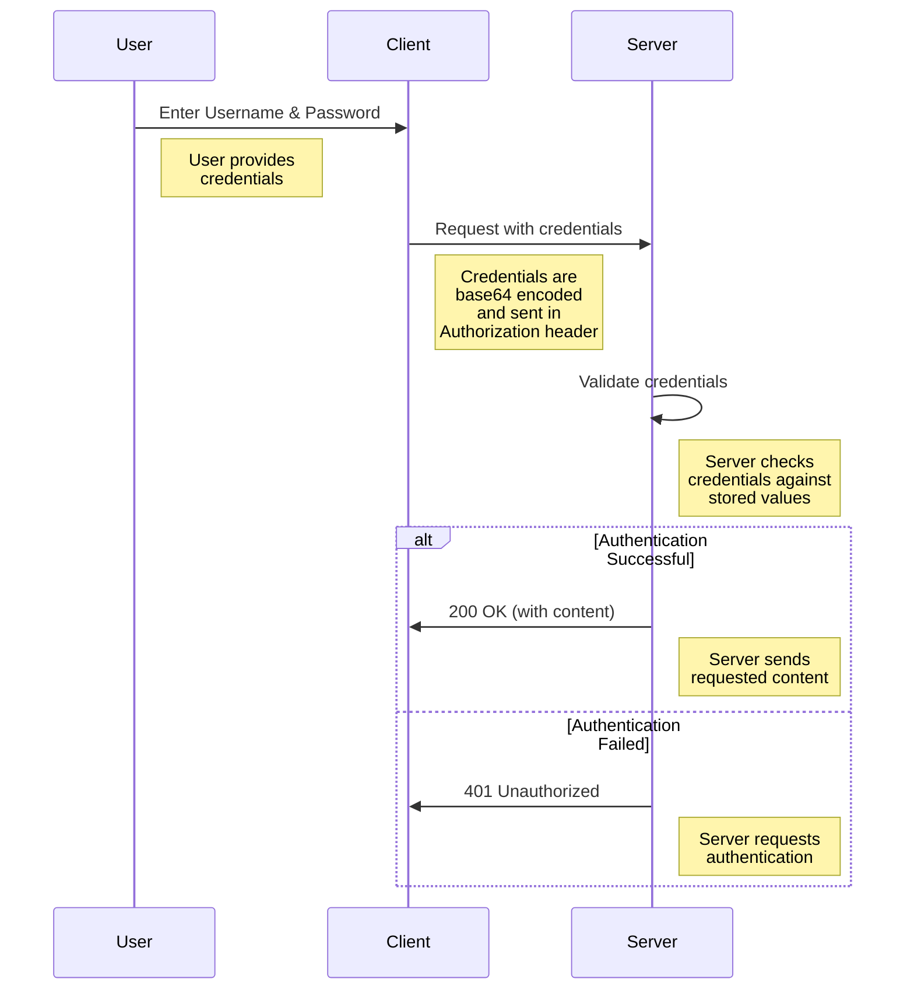
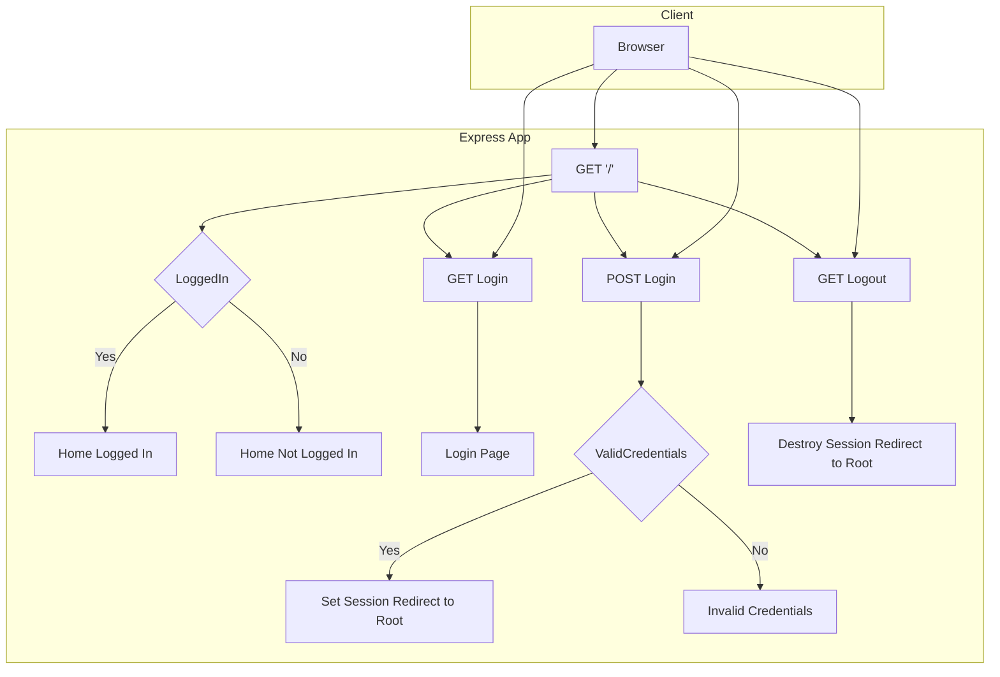

# edu-authentication - Basic Auth

## Instructions

### Project

```bash
#Create directory for react application
mkdir basic-auth && cd basic-auth

mkdir -p src/routes
touch ./src/service.js
touch ./src/server.js
touch ./src/routes/auth_routes.js

# Initialize a new Node.js project
npm init -y

# Install packages
npm install express
npm install express-session
npm install body-parser
npm install -D nodemon jest

# Set up scripts in package.json
npm pkg set main="./src/service.js"
npm pkg set scripts.start="node ./src/service.js"
npm pkg set scripts.dev="nodemon ./src/service.js"
npm pkg set scripts.test="jest"
```

### src/service.js

```bash
cat > src/service.js << 'EOF'
const app = require('./server');
const PORT = 3000;

// Server
app.listen(PORT, () => {
    console.log(`Server is running on http://localhost:${PORT}`);
});
EOF
```

### src/server.js

```bash
cat > src/server.js << 'EOF'
const express = require('express');
const bodyParser = require('body-parser');
const session = require('express-session');
const authRoutes = require('./routes/auth_routes');

const app = express();

// Middleware
app.use(bodyParser.urlencoded({ extended: false }));
app.use(session({
    secret: 'your_secret_key',
    resave: false,
    saveUninitialized: true
}));

// Use auth routes
app.use(authRoutes);

module.exports = app;
EOF
```

### src/service.js

```bash
cat > src/routes/auth_routes.js << 'EOF'
const express = require('express');
const router = express.Router();

// Mock user
const user = {
    username: 'user',
    password: 'password'
};

// Routes
router.get('/', (req, res) => {
    const isLoggedIn = req.session.isLoggedIn;
    res.send(`
        <h1>Welcome</h1>
        <p>${isLoggedIn ? 'Logged in' : 'Not logged in'}</p>
        <a href="/login">Login</a> | <a href="/logout">Logout</a>
    `);
});

router.get('/login', (req, res) => {
    res.send(`
        <h1>Login</h1>
        <form method="post" action="/login">
            Username: <input type="text" name="username" required><br>
            Password: <input type="password" name="password" required><br>
            <input type="submit" value="Login">
        </form>
    `);
});

router.post('/login', (req, res) => {
    const { username, password } = req.body;
    if (username === user.username && password === user.password) {
        req.session.isLoggedIn = true;
        res.redirect('/');
    } else {
        res.send('Invalid credentials. <a href="/login">Try again</a>');
    }
});

router.get('/logout', (req, res) => {
    req.session.destroy(err => {
        if (err) {
            return res.redirect('/');
        }
        res.redirect('/');
    });
});

module.exports = router;
EOF
```

## Sequence Diagram



## Topology



## Server.js

```js
const express = require('express');
const bodyParser = require('body-parser');
const session = require('express-session');

const app = express();
const PORT = 3000;

// Middleware
app.use(bodyParser.urlencoded({ extended: false }));
app.use(session({
    secret: 'your_secret_key',
    resave: false,
    saveUninitialized: true
}));

// Mock user
const user = {
    username: 'user',
    password: 'password'
};

// Routes
app.get('/', (req, res) => {
    const isLoggedIn = req.session.isLoggedIn;
    res.send(`
        <h1>Welcome</h1>
        <p>${isLoggedIn ? 'Logged in' : 'Not logged in'}</p>
        <a href="/login">Login</a> | <a href="/logout">Logout</a>
    `);
});

app.get('/login', (req, res) => {
    res.send(`
        <h1>Login</h1>
        <form method="post" action="/login">
            Username: <input type="text" name="username" required><br>
            Password: <input type="password" name="password" required><br>
            <input type="submit" value="Login">
        </form>
    `);
});

app.post('/login', (req, res) => {
    const { username, password } = req.body;
    if (username === user.username && password === user.password) {
        req.session.isLoggedIn = true;
        res.redirect('/');
    } else {
        res.send('Invalid credentials. <a href="/login">Try again</a>');
    }
});

app.get('/logout', (req, res) => {
    req.session.destroy(err => {
        if (err) {
            return res.redirect('/');
        }
        res.redirect('/');
    });
});

// Server
app.listen(PORT, () => {
    console.log(`Server is running on http://localhost:${PORT}`);
});
```
