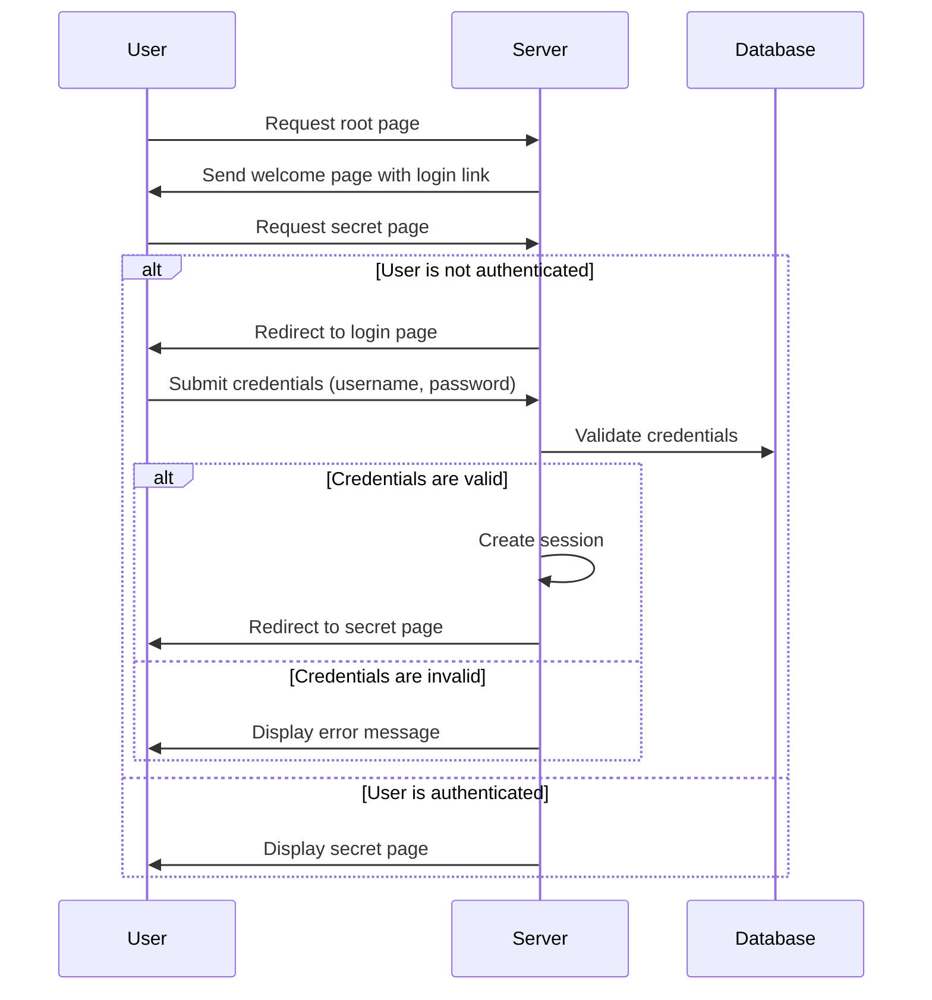

# edu-authentication - Session Based Auth

## Instructions

### Project

```bash
#Create directory for react application
mkdir session-auth && cd session-auth

mkdir -p src/routes
touch ./src/service.js
touch ./src/server.js
touch ./src/routes/public_routes.js
touch ./src/routes/secret_routes.js

# Initialize a new Node.js project
npm init -y

# Install packages
npm install express
npm install express-session
npm install -D nodemon jest

# Set up scripts in package.json
npm pkg set main="./src/service.js"
npm pkg set scripts.start="node ./src/service.js"
npm pkg set scripts.dev="nodemon ./src/service.js"
npm pkg set scripts.test="jest"
```

### src/service.js

```bash
cat > src/service.js << 'EOF'
const app = require('./server');
const PORT = 3000;

// Server
app.listen(PORT, () => {
    console.log(`Server is running on http://localhost:${PORT}`);
});
EOF
```

### src/server.js

```bash
cat > src/server.js << 'EOF'
const express = require('express');
const session = require('express-session');

const publicRoutes = require('./routes/public_routes');
const secretRoutes = require('./routes/secret_routes');
const authRoutes = require('./routes/auth_routes');


const app = express();

app.use(express.json());
app.use(express.urlencoded({ extended: true }));

app.use(session({
    secret: 'your_secret_key',
    resave: false,
    saveUninitialized: true,
    cookie: { secure: false } // for development
}));

app.use(publicRoutes);
app.use('/secret', secretRoutes);
app.use('/auth', authRoutes);

module.exports = app;
EOF
```

### src/routes/public_routes.js

```bash
cat > src/routes/public_routes.js << 'EOF'
const express = require('express');
const router = express.Router();

router.get('/', (req, res) => {
    const greeting = () => req.session.user ? `Hello, ${req.session.user.username}` : 'Hello, guest';

    res.send(`
        <h1>${greeting()} Welcome to the public area</h1>
        <p><a href="/auth/login">Login</a></p>
        <p><a href="/secret/">Secret</a></p>
    `);
});

module.exports = router;
EOF
```

### src/routes/auth_routes.js

```bash
cat > src/routes/auth_routes.js << 'EOF'
const express = require('express');
const router = express.Router();

router.get('/login', (req, res) => {
    res.send(`
        <h1>Login</h1>
        <form method="post" action="/auth/login">
            <label for="username">Username:</label>
            <input type="text" id="username" name="username" required><br>
            <label for="password">Password:</label>
            <input type="password" id="password" name="password" required><br>
            <input type="submit" value="Login">
        </form>
    `);
});

router.post('/login', (req, res) => {
    const { username, password } = req.body;

    // TODO: Validate credentials and handle login logic

    req.session.user = { username };
    res.redirect('/secret');
});

router.post('/logout', (req, res) => {
    req.session.destroy();
    res.redirect('/auth/login');
});

module.exports = router;
EOF
```

### src/routes/secret_routes.js

```bash
cat > src/routes/secret_routes.js << 'EOF'
const express = require('express');
const router = express.Router();

const isAuthenticated = (req, res, next) => {
    if (req.session && req.session.user) {
        return next();
    }
    
    return res.status(401).send(`
        <h1>You are not authenticated</h1>
        <p><a href="/">Back</a></p>
    `);
};

router.use(isAuthenticated);

router.get('/', (req, res) => {
    
    const greeting = () => req.session.user ? `Hello, ${req.session.user.username}` : 'Hello, guest';
    
    res.send(`
        <h1>${greeting()} Welcome to the secret area</h1>
        <p><a href="/">Back</a></p>
        <form method="POST" action="/auth/logout">
            <input type="submit" value="Logout">
        </form>
    `);
});
module.exports = router;
EOF
```

## Sequence Diagram


