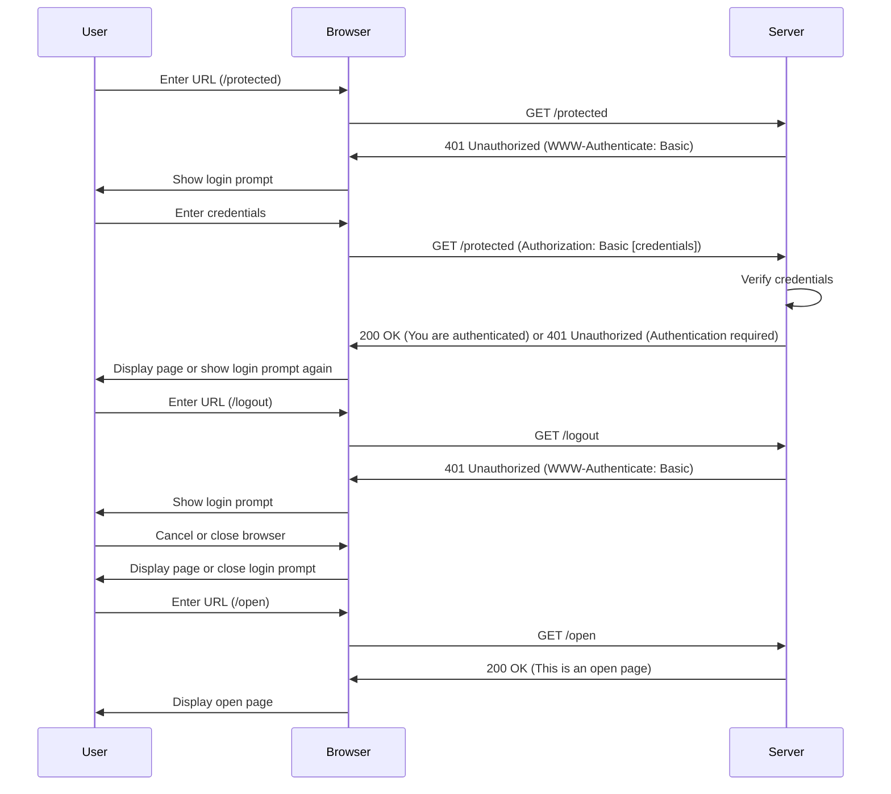
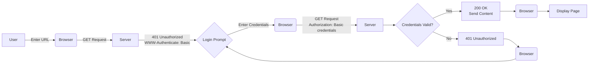

# edu-authentication - Basic Auth

## Instructions

### Project

```bash
#Create directory for react application
mkdir basic-auth && cd basic-auth

mkdir -p src/routes
touch ./src/service.js
touch ./src/server.js
touch ./src/routes/auth_routes.js

# Initialize a new Node.js project
npm init -y

# Install packages
npm install express 
npm install -D nodemon jest

# Set up scripts in package.json
npm pkg set main="./src/service.js"
npm pkg set scripts.start="node ./src/service.js"
npm pkg set scripts.dev="nodemon ./src/service.js"
npm pkg set scripts.test="jest"
```

### src/service.js

```bash
cat > src/service.js << 'EOF'
const app = require('./server');
const PORT = 3000;

// Server
app.listen(PORT, () => {
    console.log(`Server is running on http://localhost:${PORT}`);
});
EOF
```

### src/server.js

```bash
cat > src/server.js << 'EOF'
const express = require('express');
const authRoutes = require('./routes/auth_routes');

const app = express();

// Use auth routes
app.use(authRoutes);

module.exports = app;
EOF
```

### src/routes/auth_routes.js

```bash
cat > src/routes/auth_routes.js << 'EOF'
const express = require('express');
const router = express.Router();

// Mock user
const user = {
    username: 'user',
    password: 'password'
};

router.get('/protected', (req, res) => {
    const authHeader = req.headers.authorization;

    if (!authHeader) {
        res.setHeader('WWW-Authenticate', 'Basic realm="Secure Area"');
        return res.status(401).send('Authentication required');
    }

    const base64Credentials = authHeader.split(' ')[1];
    const credentials = Buffer.from(base64Credentials, 'base64').toString('ascii');
    const [username, password] = credentials.split(':');

    if (username === user.username && password === user.password) {
        return res.send('You are authenticated');
    } else {
        res.setHeader('WWW-Authenticate', 'Basic realm="Secure Area"');
        return res.status(401).send('Authentication required');
    }
});

router.get('/logout', (req, res) => {
    res.setHeader('WWW-Authenticate', 'Basic realm="Secure Area"');
    return res.status(401).send('Logged out');
});

router.get('/open', (req, res) => {
    res.send('This is an open page, no authentication required!');
});

module.exports = router;
EOF
```

## Sequence Diagram



## Topology



## Server.js

```js

```
